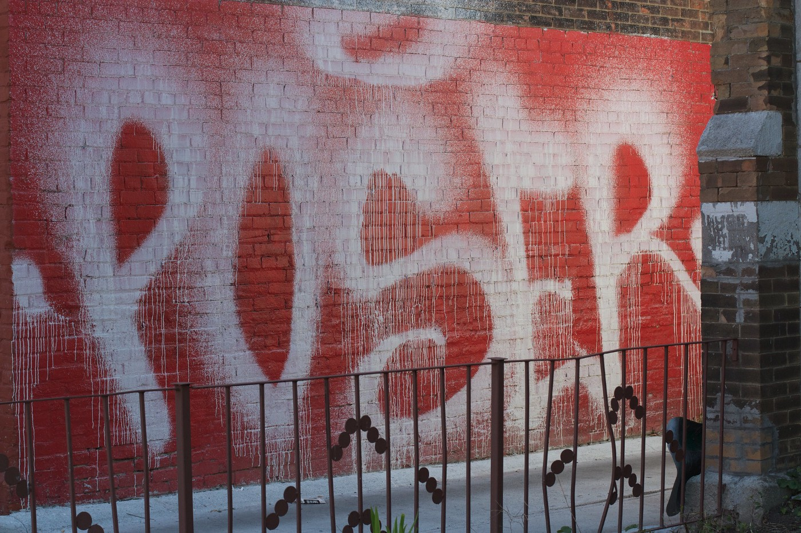

Back in 2016 — I’d read two property books (both by the same person) and my good friend was an electrician. I had a vague idea that property was a way of turning a pot of cash now into a flow of cash forever. But I also massively lacked confidence. What was a good return? What legal requirements would I need to meet? Would I end up in jail because I didn’t know the difference between a freehold and a leasehold?

_You don’t know what you don’t know._

Luckily when I started there was a monthly free informal meetup going on organised by the makers of a popular podcast. I was scared that I didn’t belong but bit the bullet and went along.

Over the course of 18 months I really enjoyed connecting with people who were doing all sorts of things in the property space and made fantastic connections which have served my bourgeoning business well.

But one of the biggest things I got from it was a true realisation that this wasn’t a closed shop. Property investors aren’t just rich old white men in gentlemen’s clubs who sit twiddling their monocles, reading the economist and chat amongst themselves about how they bought their houses for £25 in the 70s.

To my surprise, these events were full of regular people, learning, networking and hustling to go against the grain build something which might one day pay them back for the work they’re putting in.

From meeting and building relationships with these people, all of a sudden the answers to 1,000 different questions about investing and business were just a text message away. At the time I was refurbishing one house with my friend and the ‘plan’ was as loose as some notes on a scrap of paper.
I began to look forward to the meeting each month, now excited to be faced with much the same group of people, excited to hear how we were getting on and whether their advice had helped.

Over the coming months I really enjoyed connecting with all manner of pros all energised by our shared industry.

A fascinating quirk of the property industry is that because there’s so much stock to go at, 2 people doing the exact same strategy in the exact same area don’t consider each other competition, so they share incredibly freely about how they go about things.

But then in late 2018, in a change of direction for the people running this meetup, it was cancelled leaving what I felt was a void.

At this stage I knew I had strong connections — but would I begin to lose contact with these people if the formal event wasn’t there? What about the next person like me who’s looking to dip their toe? What was there for them?

There was more formal networking events in the city but even at that stage I found them hugely intimidating. Full of people hard-selling courses and mentoring and in my experience everybody throwing business cards around desperately trying to find out if you have any money to slip their way.

### Bite the bullet

Time kills momentum. I decided I couldn’t wait for the next one to come along. So I setup a small informal meeting to fill the void. I found a local pub happy to give us a corner and subscribed to meetup.com to allow us to be discovered.

### The start of something

A little while on and we’ve a steadily growing event which is designed to connect and help people. I’ve never dreamed of charging anyone to attend and would really struggle to move it away from the informal nature of a quiet corner of craft beer pub in the city centre.

It costs me a small amount of time and money to organise each month but I’ve already had that value back 100x over from what I’ve learned from people for free.

If just one other person is gaining anywhere near that kind of value then I’ll perhaps of given just a small amount back to the community.

_Fancy dropping in?_

If you’re ever in Leeds and fancy dropping in to our meetup, events are posted [here](https://alge.io/meetup "Leeds Property People Meetup").
